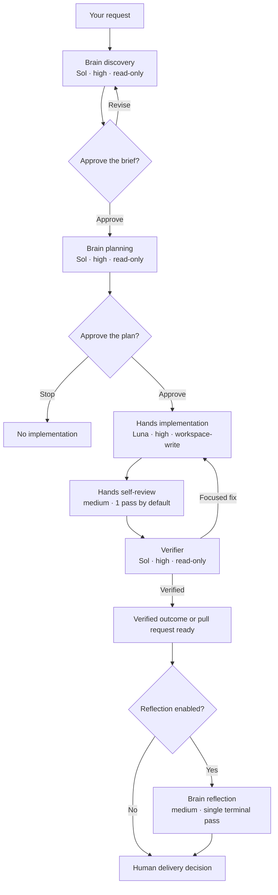
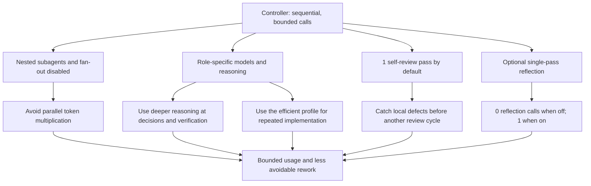
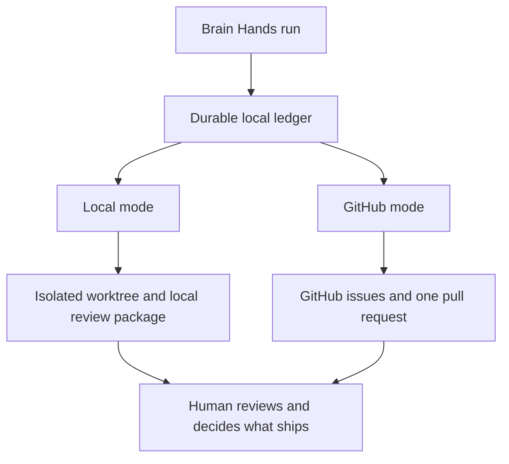

# Brain Hands / `brain-hands`

[](https://github.com/ngelik/brain-hands/actions/workflows/ci.yml)
[](https://www.npmjs.com/package/@ngelik/brain-hands)
[](LICENSE)

Brain Hands is a structured way to use Codex for changes where proving the
work matters as much as writing the code. A strong **Brain** explores and
plans, **Hands** implements only what you approved, and an independent
**Verifier** checks the result.

The `brain-hands` CLI keeps the workflow honest. It records decisions and test
evidence on disk, pauses at explicit approval points, and can safely resume an
interrupted run. You can work entirely locally or use GitHub issues and one
pull request. Brain Hands never merges or deploys automatically.

> Brain Hands is under active pre-1.0 development. Breaking changes may occur,
> with migration guidance provided in release notes.

## Why Brain Hands?

- **Plan before editing.** Brain first understands the repository and turns
  your request into a concrete plan.
- **You approve the important decisions.** The discovery brief and execution
  plan have separate, explicit approval gates.
- **Planning, implementation, and verification stay separate.** Each role has
  a narrow responsibility and the controller runs them sequentially.
- **Runs survive interruptions.** State, approvals, attempts, and evidence are
  written to a durable local ledger.
- **Verification produces evidence.** A result is not considered ready merely
  because the implementation model says it is finished.
- **GitHub is optional.** Use an isolated local worktree and review package, or
  project the same run into GitHub issues and a pull request.

## How it works



In plain terms: Brain asks questions and proposes the work; nothing is
implemented until you approve both the brief and the plan. Hands makes the
change and performs one bounded self-review pass by default. Verifier then
checks the evidence independently and either accepts it or sends a focused fix
back to Hands. Optional reflection happens once after a terminal outcome and
never reopens implementation.

## Three roles, one bounded controller

| Role or phase | Repository default | Responsibility | Cost and speed benefit |
| --- | --- | --- | --- |
| **Brain** | `gpt-5.6-sol`, high reasoning, read-only | Discover the real problem, compare approaches, and produce the approved plan | Uses deeper reasoning before writes begin, reducing expensive wrong-direction implementation |
| **Hands** | `gpt-5.6-luna`, high reasoning, workspace-write | Implement one approved work item at a time and apply focused fixes | Routes the repeated write-heavy work through the efficient implementation profile instead of using the flagship profile for every call |
| **Verifier** | `gpt-5.6-sol`, high reasoning, read-only | Run the approved checks and judge evidence independently | Concentrates deeper reasoning at the quality boundary; Verifier cannot hide a finding by editing its own review target |
| **Hands self-review** | Hands model, medium reasoning, 1 pass by default | Inspect the current diff and fix only in-scope defects before Verifier | Adds one bounded early check instead of an open-ended review swarm |
| **Reflection** | Brain model, medium reasoning, optional single pass | Explain what worked, what failed, and what to improve after the run ends | Costs nothing when disabled and one bounded synthesis call when enabled |

The exact models and reasoning levels are configurable and are shown before a
run starts. The architecture is the invariant: the controller invokes roles
sequentially, only Hands receives write access, and nested subagents and fan-out
are disabled inside every role and phase.



This is a cost-control strategy, not a fixed savings guarantee. Brain Hands
usually makes more calls and can take longer than a one-shot Codex task because
it adds approvals and independent verification. Compared with using the
strongest profile for every step or allowing nested-agent fan-out, it keeps
call amplification bounded and can save time and credits by preventing rework.
Actual usage depends on task size, retries, research, reflection, and the
selected profiles. [Codex documentation on subagents](https://learn.chatgpt.com/docs/agent-configuration/subagents)
notes that each subagent performs its own model and tool work and therefore
uses more tokens than a comparable single-agent run.



Both modes use the local ledger as the source of truth. GitHub is a delivery
and collaboration surface, not a replacement for the recorded approvals and
verification evidence.

## Which workflow fits?

| Choose | When it fits best | Workflow style |
| --- | --- | --- |
| **Vanilla Codex** | Direct, flexible collaboration for ordinary coding, review, and debugging | You guide the agent through prompts, Plan mode, `AGENTS.md`, skills, tests, and review as needed |
| **Superpowers** | A composable software-development methodology across coding agents | Skills guide brainstorming, planning, TDD, debugging, review, and agent-driven execution |
| **Brain Hands** | Changes that need durable state, exact approval boundaries, independent verification, and safe recovery | A controller enforces sequential Brain, Hands, and Verifier phases and records the evidence |

These approaches are complementary. Use vanilla Codex when a direct
conversation is enough. Use Superpowers when you want a broad, composable
skills methodology. Use Brain Hands when you want one deterministic workflow
with controller-enforced checkpoints and an auditable run history.

## Quickstart

### 1. Install the stable CLI

Brain Hands requires Node.js 20 or newer.

```bash
npm install -g @ngelik/brain-hands
brain-hands --version
```

### 2. Install the Codex plugin

Pin the marketplace to the release tag that matches the CLI version:

```bash
codex plugin marketplace add ngelik/brain-hands --ref vMAJOR.MINOR.PATCH --json
codex plugin add brain-hands@brain-hands --json
codex plugin list --json
```

Start a fresh Codex task after installing or updating the plugin so Codex loads
the new skill instructions.

### 3. Start your first task

In a Codex task, ask:

```text
Use $brain-hands to add input validation to this project.
```

On first use, the skill checks for `.brain-hands/config.yaml`, asks permission
to initialize the repository locally, and shows the complete effective
configuration before asking only for choices you have not supplied.

For direct CLI use, initialize and inspect the configuration yourself:

```bash
brain-hands init --repo .
brain-hands preview --repo .
```

## Learn more

- [Complete user guide](https://github.com/ngelik/brain-hands/blob/main/docs/USER-GUIDE.md) — configuration, commands, artifacts, approvals, recovery, and verification
- [Workflow design](agentic-codex-workflow.md) — the runtime architecture and execution contract
- [Contributing](CONTRIBUTING.md) — development and contribution expectations
- [Release guide](https://github.com/ngelik/brain-hands/blob/main/docs/RELEASING.md) — release verification and publishing
- [Support](SUPPORT.md) — usage help
- [Security](SECURITY.md) — private vulnerability reporting

## License

Licensed under the [Apache License 2.0](LICENSE).
