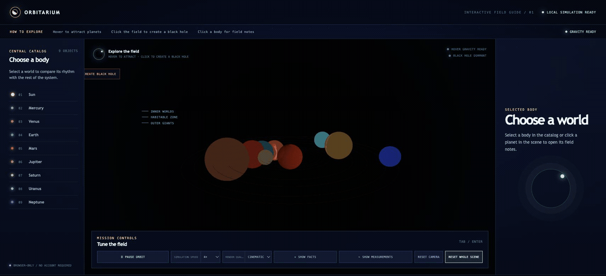
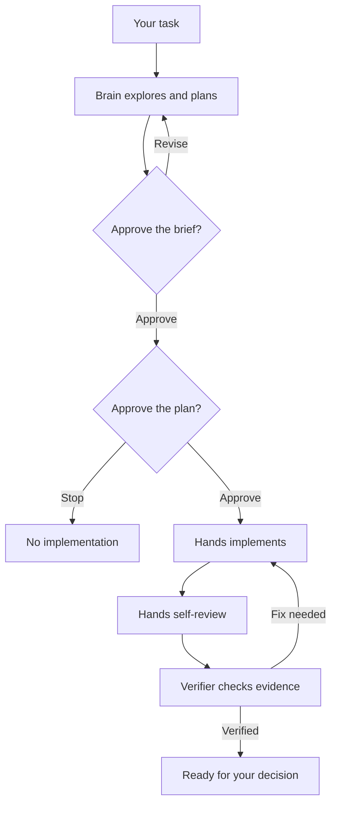
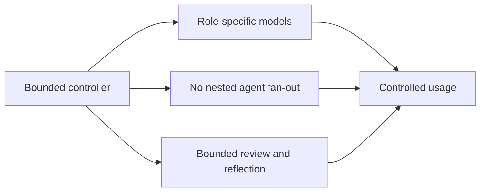
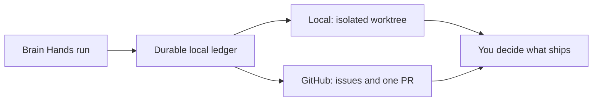

# Brain Hands / `brain-hands`

[](https://github.com/ngelik/brain-hands/actions/workflows/ci.yml)
[](https://www.npmjs.com/package/@ngelik/brain-hands)
[](LICENSE)

**Brain Hands is the project.** It is an open-source CLI and Codex plugin for
software work that needs a clear plan, explicit approval, controlled edits, and
independent verification.

**[Orbitarium is the live demo.](https://github.com/ngelik/solar-20260520)** It is a separate Solar System app built to
pressure-test Brain Hands on a real, visual project. The animation below is a
Chrome capture of that app running—not the main product.



## Why Brain Hands?

Codex is excellent at direct coding tasks. Larger changes become harder when a
single agent is expected to understand the problem, edit the code, and approve
its own result. Brain Hands separates those responsibilities:

- **Brain** explores the problem and proposes the plan.
- **You** approve the discovery brief and execution plan.
- **Hands** implements only the approved work.
- **Verifier** checks the result independently.
- **The controller** records decisions and evidence so interrupted runs can
  resume safely.

Brain Hands can run locally in an isolated worktree or coordinate GitHub issues
and one pull request. It never merges or deploys automatically.

> Brain Hands is under active pre-1.0 development. Breaking changes may occur,
> with migration guidance provided in release notes.

## How it works



Nothing is implemented until you approve both the brief and the plan. Hands
then works within that boundary, and Verifier either accepts the evidence or
sends back a focused fix.

## Three roles, one controller

| Role or phase | Default | What it does |
| --- | --- | --- |
| **Brain** | `gpt-5.6-sol`, high reasoning, read-only | Understands the problem and prepares the plan |
| **Hands** | `gpt-5.6-luna`, high reasoning, workspace-write | Implements approved work and focused fixes |
| **Verifier** | `gpt-5.6-sol`, high reasoning, read-only | Reviews the result and its evidence independently |
| **Hands self-review** | Hands model, medium reasoning, 1 pass by default | Catches local mistakes before Verifier runs |
| **Reflection** | Brain model, medium reasoning, optional single pass | Summarizes lessons after the run ends |

The models are configurable. The safety boundary is not: only Hands receives
write access, and the controller runs roles sequentially. It disables
nested subagents and fan-out inside the workflow.



This is a cost-control strategy, not a fixed savings guarantee. Brain Hands
usually makes more calls and can take longer than a one-shot Codex task because
it adds approvals and independent verification. Its goal is to limit avoidable
rework and uncontrolled call multiplication. Actual usage depends on the task,
models, retries, research, and reflection. The [Codex documentation on
subagents](https://learn.chatgpt.com/docs/agent-configuration/subagents) explains
why each additional agent also adds model and tool work.

## Live proof: Orbitarium

[Orbitarium](https://github.com/ngelik/solar-20260520) is an interactive,
browser-only Solar System. It was built as an end-to-end Brain Hands test in
GitHub mode, covering discovery, approvals, issue breakdown, implementation,
focused repairs, browser evidence, recovery, and independent review.

The test also improved Brain Hands itself. Problems exposed while building the
demo led to focused controller fixes and regression tests before the run
continued. See the [public execution
trail](https://github.com/ngelik/solar-20260520/issues). The complete demo code
will be pushed after final verification. Codex task:
`019f8045-f48a-7f02-8042-47786810fa93`.

## Local or GitHub



The local ledger remains the source of truth in both modes. GitHub is an
optional collaboration and delivery surface.

## When should I use it?

| Choose | Best for |
| --- | --- |
| **Vanilla Codex** | Direct coding, review, and debugging where conversation is enough |
| **Superpowers** | A broad set of composable software-development practices |
| **Brain Hands** | Work that needs durable state, exact approvals, independent verification, and safe recovery |

These approaches are complementary. Brain Hands is deliberately heavier than a
normal Codex task; use it when the extra control and evidence are worth it.

## Quickstart

Brain Hands requires Node.js 20 or newer.

```bash
npm install -g @ngelik/brain-hands
brain-hands --version
```

Install the matching Codex plugin release:

```bash
codex plugin marketplace add ngelik/brain-hands --ref vMAJOR.MINOR.PATCH --json
codex plugin add brain-hands@brain-hands --json
codex plugin list --json
```

Start a fresh Codex task and ask:

```text
Use $brain-hands to add input validation to this project.
```

For direct CLI use:

```bash
brain-hands init --repo .
brain-hands preview --repo .
```

## Built with Codex and GPT-5.6

I used Codex throughout Brain Hands to explore the design, turn ideas into
explicit contracts, implement changes, reproduce failures, write regression
tests, review diffs, and verify releases. GPT-5.6 handled the judgment-heavy
planning, architecture, debugging, and review work.

The collaboration was iterative, not a one-prompt generation. Codex proposed
and challenged approaches; I chose the product boundaries and safety tradeoffs;
the repository's tests and release checks decided whether each change was ready.

## Learn more

- [Complete user guide](https://github.com/ngelik/brain-hands/blob/main/docs/USER-GUIDE.md) — setup, configuration, commands, approvals, recovery, and verification
- [Workflow design](agentic-codex-workflow.md) — runtime architecture and contracts
- [Contributing](CONTRIBUTING.md)
- [Release guide](https://github.com/ngelik/brain-hands/blob/main/docs/RELEASING.md)
- [Support](SUPPORT.md)
- [Security](SECURITY.md)

## License

Licensed under the [Apache License 2.0](LICENSE).
