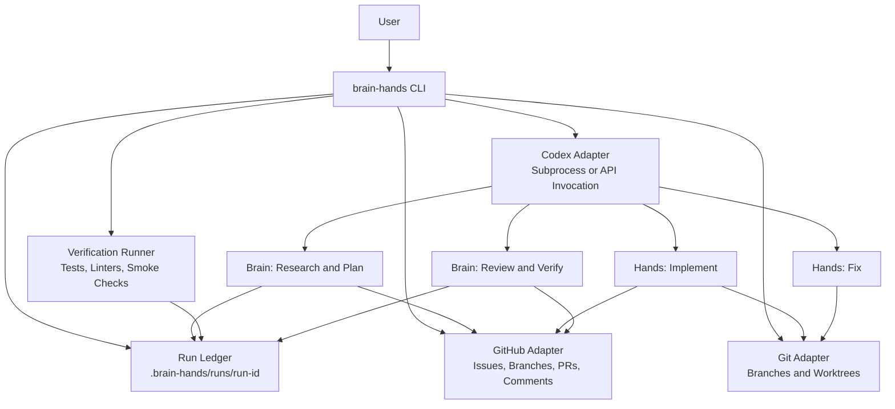
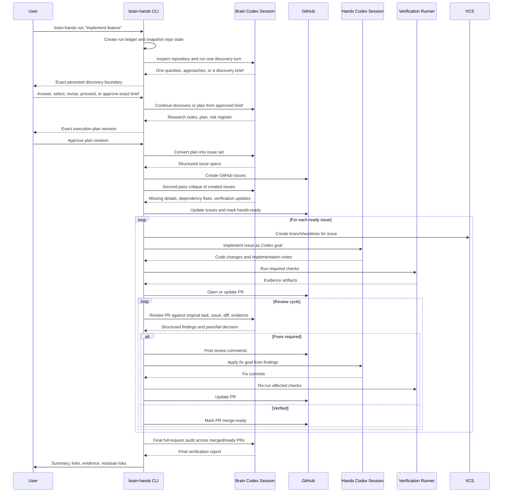
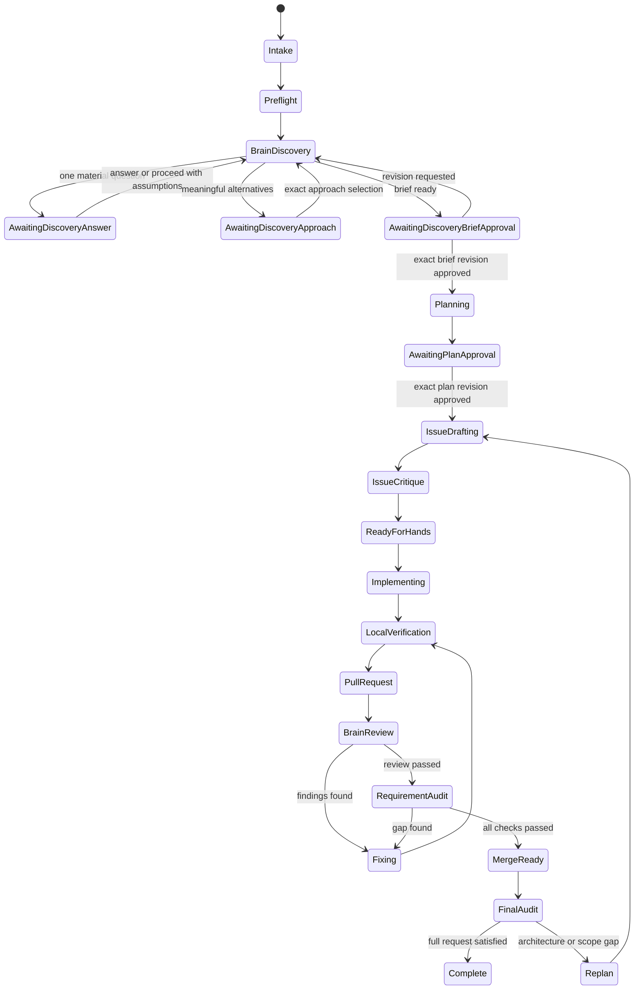
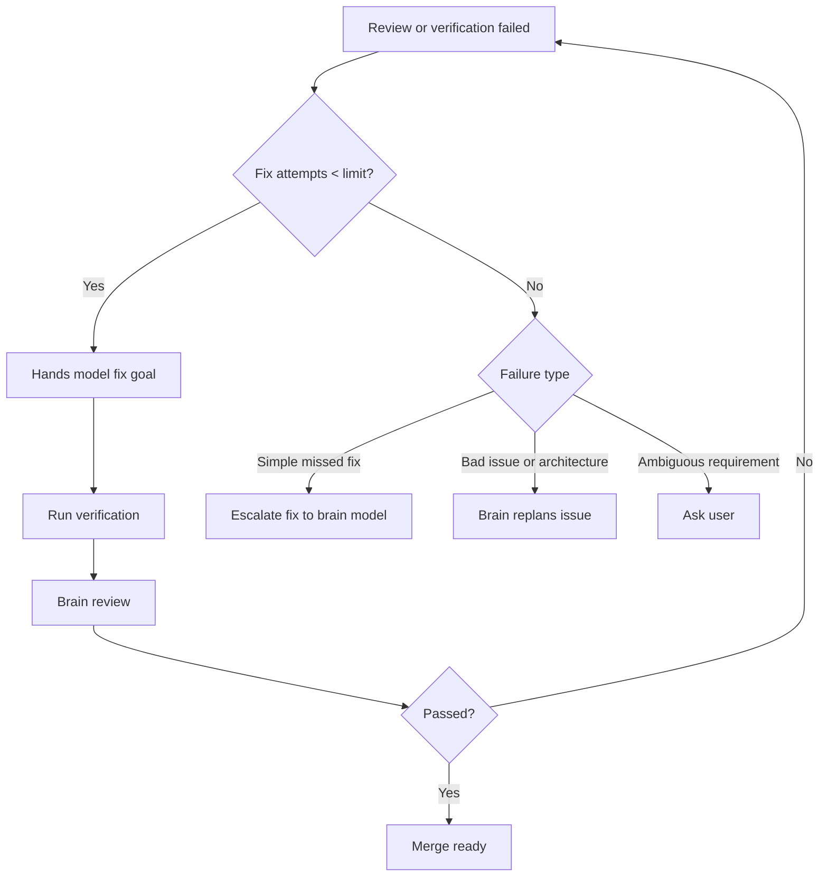

# Agentic Codex Workflow

## Executive Summary

Build a CLI tool, tentatively named `brain-hands`, that orchestrates Codex itself.
The user gives one task to the CLI. The CLI then calls Codex multiple times with different model profiles:

- **Brain model**: expensive, strongest available model. Owns research, planning, architecture review, GitHub issue authoring, PR review, and final verification.
- **Hands model**: cheaper, faster model. Owns implementation and requested fixes only.
- **CLI orchestrator**: owns state, sequencing, retries, GitHub operations, branch/worktree isolation, Codex invocation, and evidence collection.

The key design improvement is that the models should not coordinate informally through chat. The CLI should be the control plane, and GitHub issues/PRs should be durable work artifacts.

## Brain Hands skill contract

The packaged `$brain-hands` skill is the conversational front door. It detects
an explicit Brain Hands request, asks only for omitted `local`/`github`,
research, and reflection choices, resolves Brain/Hands/Verifier models from
config, drives the engine-owned discovery actions, displays the Brain plan, and
waits for both explicit approvals. It delegates state, model calls, worktrees,
verification, GitHub delivery, and recovery to `brain-hands`; silence is never
approval.

Every new run uses `durable-discovery-v1`, stops successfully at the first user
boundary, and asks one question at a time. The skill presents engine-authored
content verbatim and records one matching action:

```text
brain-hands answer-discovery --run <run-dir> --question <id> [--input-file <path>]
brain-hands select-discovery-approach --run <run-dir> --revision <number> --approach <id>
brain-hands proceed-discovery --run <run-dir> [--input-file <path>]
brain-hands revise-discovery --run <run-dir> --revision <number> [--input-file <path>]
brain-hands approve-discovery --run <run-dir> --revision <number>
```

Every pending action carries a fixed `permitted_next_actions` allowlist, and
readable status renders every valid command. `proceed-discovery` persists an
engine-owned forced-proceed intent under the run lock; the next Brain turn
cannot ask another question and must preserve the unresolved choice as an
linked proceed-sourced assumption whose statement preserves the operator guidance.

Initial discovery has a five-answer soft limit and six-answer hard limit. A
planning-discovered gap permits its evidence-backed question plus at most one
adaptive follow-up. Suspected secrets are rejected before ordinary persistence
or model reuse. Discovery remains local-only; GitHub receives no question,
answer, approach, draft brief, or approval content. `resume` is read-only at a
discovery boundary and returns the persisted pending action without invoking
Brain or creating a revision.

`approve-discovery` verifies and pins the exact brief revision and SHA-256.
Brain planning consumes those approved bytes, and planning and resume verify
the digest again. Discovery approval and plan approval are separate gates;
`approve-plan` alone starts Hands and target/GitHub mutation. Persisted runs
without discovery metadata remain `legacy-v2` and resume without fabricated
discovery state.

The three roles have separate responsibilities:

- **Brain** uses read-only access for built-in web research, architecture and
  issue planning, review, requirement audit, and final delivery judgment.
- **Hands** uses workspace-write access only in the isolated run worktree to
  implement one approved work item or apply requested fixes.
- **Verifier** uses read-only access to run and inspect the frozen verification
  contract, browser evidence, artifacts, and diff before any commit or delivery.

Approval is a hard boundary. Before `approve-plan --revision N`, the target
repository and GitHub must not be mutated. Earlier discovery-brief approval
authorizes planning only. Plan approval freezes that plan revision; new scope
or verification commands require a new revision and approval.
GitHub mode creates or recovers labeled issues and one pull request, but the
issue status projection is never workflow authority. Brain Hands keeps one
owned status comment and one exclusive `brain-hands:*` state label per
work-item issue, creates immutable material events only after durable evidence
or review decisions, and posts a pull-request comment only for verified final
delivery. Status-comment and label projection failures are retryable local
state; they never bypass approval or block an otherwise valid delivery. The
pull request's Brain Hands-owned closing-link block is a delivery contract:
the pull request must target GitHub's actual default branch, and every mapped
parent and child must appear in GitHub's parsed closing references before the
run reports `github_ready`.
The workflow never merges. Local mode never calls GitHub or remote Git operations.

New plans carry a compact lowercase `feature_slug`. GitHub child issue titles
are formatted deterministically as
`[<feature_slug>:<execution_sequence>:<work_item.id>] <work_item.title>`.
Models must leave the prefix and sequence out of `work_item.title`; the runtime
alone topologically orders approved work items and adds both. Dependencies
precede dependents, and approved plan order breaks ties between independent
items. The execution sequence is presentation-only: stable work-item IDs and
run/work-item HTML markers remain authoritative. Dependency changes may
renumber visible titles without changing issue numbers or mappings. Run ID,
plan revision, dependencies, and the machine-readable issue spec live in a
managed body section, while user-authored text outside that section is
preserved.
Legacy plans without `feature_slug` remain resumable. When an old work-item ID
cannot satisfy the new slug contract, Brain Hands preserves its prior
unprefixed display title instead of changing the ledger or marker identity.
Marker lookup also permits approved revisions to insert, reorder, or change
dependencies between work items without corrupting issue mappings. A revision
that would detach an already persisted issue fails closed for explicit operator
handling.

An approved plan may request one parent issue. Its generated title may include
the feature slug but remains unnumbered. Parent identity and its issue number
are stored separately from child `issue_numbers`, so the work-item mapping
remains stable. The parent tracks child issue links and the single integrated
pull request closes the parent and all children only when it
merges into the default branch. Verifier completion alone leaves issues open;
human-accepted runs with a pull request also wait for that merge before closing
as completed. Explicit abandoned or closed-blocked runs close owned issues as
not planned, while ordinary blockers remain resumable and open. The
`close-run --outcome blocked` CLI choice is what records `closed_blocked`; a
runtime blocker alone does not. Use `reconcile-github` without `--apply` to
audit lifecycle state, and add `--apply` only for explicit marker-authorized
repair. `status` never performs reconciliation mutations.

Run artifacts are durable under:

```text
.brain-hands/runs/<run-id>/
  manifest.json  intake.json  preflight.json  events.jsonl  progress.jsonl
  discovery/questions/  discovery/answers/  discovery/approaches/
  discovery/proceed-with-assumptions.json  discovery/briefs/
  discovery/approved-brief.json
  plan-revisions/  issues/  work-items/  verification/
  reviews/  responses/  prompts/  schemas/
  summaries/  evidence-indexes/  contexts/  budgets/
  reflection.json  reflection.md
.brain-hands/improvement-plans/<timestamp>/
```

`events.jsonl` is approval and delivery provenance. `progress.jsonl` is a
separate safe observational timeline used by `status`, `logs --follow`, and
producer `--follow` output. Long subprocesses append heartbeats every 45
seconds; five minutes without activity is reported only as possibly stale and
never causes Brain Hands to start another worker. Progress events never replace
the manifest, evidence, structured role artifacts, or Verifier decisions.
Plain human progress views coalesce heartbeat runs and duplicate unreadable
progress warnings; `logs --json` remains the lossless raw event view.

New runs use `bounded-context-v1`: full evidence remains in the ledger, while
Hands, Verifier, and reflection receive immutable compact context packages with
scoped diffs, exact evidence references, and byte caps. Completed work items get
immutable summaries; final Verifier uses separate `final-integrated` and
`post-pr` indexes; reflection uses a terminal index. Budgets under `budgets/`
govern model invocations, workflow attempts, total tokens, active elapsed time,
and external effects. Missing token usage after a started turn makes accounting
uncertain; a structured terminal error before `turn.started` is recorded as
zero token usage.

### Canonical session contract

New runs also persist the paired canonical artifacts
`session-state.json` and `session-events.jsonl`. The run-wide `run_id`,
`session_id`, and preallocated `canonical_event_id` are stable across all
approval-separated CLI processes. `progress.jsonl` may contain one process's
worker session identifiers, but it is raw/normalized observation and is never
the session identity or the canonical aggregate.

Canonical state updates, progress contributions, and finalization use the run
ledger's compound lock; read-only inspection applies the same pair validation
without repairing either file. The state is a bounded aggregate over validated safe
progress events: fixed command, invocation, status, source, and token maps use
safe non-negative counters, and timestamps and duration must remain ordered.
The implementation does not rebuild this summary by replaying or trusting the
raw progress stream. The event stream is append-only and has at most one
canonical finalized record; concurrent finalizers return the same record rather
than duplicating it.

The pair is strict. State and event schemas must validate, their run/session/
event identities must match, and finalized terminal fields must match the
manifest's terminal provenance (`actor`, `recorded_at`, and `source_stage`). An
active state has null terminal fields and an empty event stream. Finalized state
has a terminal outcome, assurance outcome, and terminal provenance; its one
event is materialized from that state. A half-final state with the event append
missing is accepted only by the finalization retry path. Invalid or missing
paired artifacts are observed as unavailable and are not repaired by readers.

Producing-command terminal ordering is part of the contract:

1. Record the worker start and settled command outcome in the bounded
   aggregate.
2. After the producing action settles, record terminal provenance in the
   manifest and associate the terminal assurance outcome.
3. Reconcile durable GitHub effects, when applicable, and reload the manifest.
4. Run reflection after terminalization; reflection is an audit artifact and
   never reopens implementation.
5. Recompute and persist final-delivery assurance. `verified_ready` requires
   the exact approved plan revision, candidate commit, completed attempts, and
   final evidence to prove the candidate; workflow stage or PR existence alone
   is insufficient.
6. Under the run lock, finalize the canonical state and append exactly one
   `session_finalized` event. If that append fails, the terminal workflow
   result remains authoritative and a later producing command or `resume`
   retries finalization without adding post-terminal progress.

The controller owns this ordering and uses no controller defaults for Brain's
discovery recommendations. Brain authors the recommended choice and rationale
for a material question, and the recommended approach and rationale when
approaches are offered. The controller validates, persists, and displays those
recommendations verbatim; they are guidance, not approval, and a missing
recommendation is not silently invented by the controller.

Hands artifacts use canonical run-relative paths. An implementation report is
stored as `implementation/<safe-work-item-id>/attempt-<N>.json`; self-review
reports use `self-review/<safe-work-item-id>/attempt-<parent-attempt>/pass-<P>.json`.
Persisted Hands report paths must use forward slashes, name an artifact below
the current run directory, and contain no absolute path, empty segment, `.`,
or `..` segment. These paths are durable provenance in the manifest and are
reused during recovery.

### Delivery effects and recovery

GitHub delivery performs a duplicate precheck using the durable run/work-item
markers before creating anything. It reconciles or creates one issue for each
approved work item (plus the optional parent issue), then finds or creates one
integrated pull request for the exact branch and candidate commit. The pull
request must target the repository default branch and contain parsed closing
references for the mapped issues. Resume recovers those marker-owned issues
and the pull request by their persisted identities; it does not create a
second copy after an interrupted delivery. Delivery never merges or releases
automatically; an open pull request is the handoff for human review.

Each approved run uses
`SOURCE_REPO/.brain-hands/worktrees/<run-id>/` on branch
`codex/brain-hands/<run-id>`. After a completed or blocked run, inspect the
ledger and preserve evidence before cleaning the worktree with the normal Git
worktree command. Never delete a worktree that an unfinished run still names.

The selected V2 role defaults are Brain `gpt-5.6-sol` with `high`, Hands
`gpt-5.6-luna` with `high`, and Verifier `gpt-5.6-sol` with `high`. Hands
self-review and reflection use phase-specific `medium` reasoning by default. The
reference model matrix is documented in the README; it is not the runtime
authority. Runtime selection must match the full model ID and
`supported_reasoning_levels` returned by the live `codex debug models` catalog
exactly. No aliases, guessed IDs, substitutions, fallback, or runtime
reasoning allowlist are used.

## Current Codex CLI invocation flags

Live role invocations use the current structured-output contract:

```text
codex exec --ephemeral [--ignore-user-config] \
  --model <model> \
  -c model_reasoning_effort="<low|medium|high>" \
  --sandbox <read-only|workspace-write> \
  -C <worktree> \
  --output-schema <run>/schemas/<artifact>.json \
  --output-last-message <run>/responses/<artifact>.json \
  [--search]
```

`--search` is added only when research is enabled and preflight confirms that
the installed Codex supports it. Reasoning is set through
`-c model_reasoning_effort="..."`, not as a standalone CLI argument. Every
invocation is preflight-checked and its prompt, schema, stdout, stderr, and
parsed response are written to the run ledger. A raw call should therefore
look like `codex exec --model gpt-5.6-sol -c
'model_reasoning_effort="high"' ...`.

The required preflight validates Brain, Hands, and Verifier selections against
the live catalog. The same exact check runs before every
`SubprocessCodexAdapter` exec and before the optional live preflight probe. A
failure blocks the corresponding exec. The remedy is to update Codex, inspect
`codex debug models`, and set the exact configured profile `model` and
`reasoning_effort` values reported there.

## Critical Review of the Original Design

The previous workflow was directionally correct, but it had several gaps:

- **No real orchestrator contract**: it described the model roles but not the CLI/state machine that controls them.
- **Too much implicit trust in model output**: the brain model must verify against real files, real diffs, real commands, and real artifacts.
- **GitHub issues were underspecified**: issues need a strict schema so the hands model receives executable work, not prose.
- **Review comments were too informal**: PR feedback should be both human-readable and machine-readable so fix goals can be generated reliably.
- **Iteration count was vague**: "double-check three times" should be three different review lenses, not the same review repeated.
- **No bounded retry policy**: infinite review/fix loops can waste money and produce churn. The CLI needs escalation rules.
- **No branch/worktree isolation**: one issue should map to one branch or worktree to prevent cross-issue contamination.
- **No resumability**: long agentic workflows will fail. The CLI must resume from a run ledger.
- **No prompt/version audit trail**: every model call should be reproducible enough to diagnose bad plans or bad fixes.
- **No small-task fast path**: GitHub issue decomposition is valuable, but tiny tasks should support a lightweight mode.

## Improved Architecture



The CLI should be deterministic where possible. Models produce plans, code, and reviews, but the CLI decides what happens next based on explicit state transitions.

## End-to-End Flow



## State Machine



## CLI Commands

Implemented CLI surface in the current MVP:

```text
brain-hands init
brain-hands run "<task>" --repo .
brain-hands answer-discovery --run <run-id> --question <id>
brain-hands select-discovery-approach --run <run-id> --revision <number> --approach <id>
brain-hands proceed-discovery --run <run-id>
brain-hands revise-discovery --run <run-id> --revision <number>
brain-hands approve-discovery --run <run-id> --revision <number>
brain-hands approve-plan --run <run-id> --revision <number>
brain-hands implement --run <run-id> --issue <number>
brain-hands review --run <run-id> --issue <number> --pr <number>
brain-hands fix --run <run-id> --issue <number> --pr <number>
brain-hands resume --run <run-id>
brain-hands status --run <run-id>
brain-hands logs --run <run-id>
brain-hands logs --follow --run <run-id>
brain-hands final-audit --run <run-id>
brain-hands doctor --repo . --mode local
```

`run` stops at its first user boundary. Each discovery mutation stops at the
next user boundary; `status` and discovery-boundary `resume` are read-only.
`run`, the discovery mutations, `approve-plan`, and `resume` accept `--follow`
and render the same compact safe run-level timeline to stderr. `progress.jsonl` is append-only normalized
operator telemetry; it contains no raw Codex JSONL, commands, output, paths,
findings, or model-generated text. Progress is not approval evidence.
`events.jsonl`, validated role artifacts, exact plan revision approval,
verification evidence, and final Verifier provenance remain authoritative.

Future or non-MVP commands such as `plan`, `create-issues`, or `verify` are design ideas only and are not runnable in the current implementation.

## Same-Run Recovery Order

Interrupted work recovers in the existing run first. The operator contract is:

1. inspect status/logs with `brain-hands status --run <run-id>` and
   `brain-hands logs --run <run-id> --follow`.
2. resume the existing run with `brain-hands resume --run <run-id>`.
3. authorize one diagnostic retry when required with
   `brain-hands resume --run <run-id> --actor <identity> --recovery-note-file <path>`.
4. attest an expected controller hash when required with
   `brain-hands recover-controller --run <run-id> --actor <identity> --reason <reason> --expected-package-sha256 <sha256>`.
5. explicitly abandon only when same-run recovery is unsafe with
   `brain-hands abandon --run <run-id> --actor <identity> --reason <reason>`.
6. replace only an abandoned run with
   `brain-hands replace --run <run-id> --actor <identity> --reason <reason>`.
7. never use ordinary run for recovery; `brain-hands run` creates a new root
   run and cannot consume diagnostic authorization or controller recovery.
8. never reuse approval or GitHub effects across replacement; replacement
   creates a fresh successor with no approved revision, branch, worktree,
   issue, pull request, delivery, risk, or final-artifact state.

`verified_ready`, `human_accepted`, `blocked`, and `abandoned` are distinct
operator outcomes. Diagnostic authorization does not approve implementation; it
permits one exact retry only. Controller attestation does not approve
implementation; it records a controller provenance transition only.

## Run Ledger

Every run should create a durable directory:

```text
.brain-hands/
  config.yaml
  runs/
    2026-07-08T12-00-00Z-feature-slug/
      manifest.json
      original-request.md
      research.md
      architecture-plan.md
      issues.json
      issue-review.md
      pr-map.json
      verification/
        issue-123/
          commands.json
          test-output.txt
          artifacts.json
      reviews/
        pr-45-review-1.json
        pr-45-review-2.json
      prompts/
        brain-planner.md
        brain-reviewer.md
        hands-implementer.md
        hands-fixer.md
```

The ledger is mandatory. It gives the CLI resumability, auditability, and a clean way to pass context between model calls without relying on hidden conversation state.

## Model Profiles

```yaml
profiles:
  brain:
    model: gpt-5.6-sol
    reasoning_effort: high
    sandbox: read-only

  hands:
    model: gpt-5.6-luna
    reasoning_effort: high
    sandbox: workspace-write

  verifier:
    model: gpt-5.6-sol
    reasoning_effort: high
    sandbox: read-only

phase_reasoning:
  hands_self_review: medium
  reflection: medium
```

The exact Codex invocation should live behind a `CodexAdapter`. That adapter can call the installed Codex CLI as a subprocess or use an API path if available. The adapter always disables nested agents and fan-out for Brain, Hands, Verifier, self-review, reflection, and analysis calls. The rest of the workflow should not depend on specific CLI flags.

## GitHub Execution Schema

Current runs use a single `ExecutionSpecV2` JSON object as the approved Brain
work item, GitHub issue payload, Hands instruction, Verifier contract, and local
review-package issue. Human GitHub headings are generated from this object.
They are a view, not a second source of truth.

```json
{
  "schema_version": "2.0",
  "id": "BH-001",
  "title": "One focused implementation result",
  "objective": "One sentence with the required end state.",
  "dependencies": [],
  "file_contract": [
    { "path": "src/example.ts", "permission": "modify", "targets": ["namedFunction"] },
    { "path": "tests/example.test.ts", "permission": "modify", "targets": ["named regression test"] }
  ],
  "forbidden_changes": [],
  "change_units": [
    { "id": "CH-01", "path": "src/example.ts", "target": "namedFunction", "operation": "modify", "requirements": ["Return the approved result for the specified input."] },
    { "id": "CH-02", "path": "tests/example.test.ts", "target": "named regression test", "operation": "modify", "requirements": ["Add the TEST-01 assertion."] }
  ],
  "acceptance": [
    { "id": "AC-01", "statement": "The specified input returns the approved result.", "satisfied_by": ["CH-01", "TEST-01"] }
  ],
  "tests": [
    { "id": "TEST-01", "path": "tests/example.test.ts", "assertion": "The specified input returns the approved result.", "verification_command_ids": ["VERIFY-01"] }
  ],
  "verification_commands": [
    { "id": "VERIFY-01", "argv": ["node", "node_modules/vitest/vitest.mjs", "run", "tests/example.test.ts"], "expected_exit_code": 0, "tier": "focused" }
  ],
  "cross_cutting_impacts": [],
  "expected_artifacts": [],
  "browser_checks": [],
  "risks": [],
  "completion_contract": {
    "expected_changed_files": ["src/example.ts", "tests/example.test.ts"],
    "allow_additional_files": false,
    "required_acceptance_ids": ["AC-01"]
  },
  "ambiguity_policy": {
    "default": "stop_and_report",
    "stop_when": ["A required change needs a path outside file_contract."]
  }
}
```

`expected_artifacts` is either an empty array or a list of safe,
repository-relative filesystem paths such as `reports/verification.json`.
Prose, URLs, descriptions, absolute paths, and traversal paths are rejected;
write prose evidence requirements in `acceptance_criteria`.

Each change unit names one exact file, target, operation, and set of concrete
requirements. Stable IDs connect the testing funnel:

```text
change unit
  -> acceptance criterion
  -> focused test/command
  -> optional required cross-cutting impact
  -> cross-cutting command
```

Verification commands remain direct argv arrays from planning through runtime.
Every acceptance criterion reaches a command directly or through a declared
test. Focused commands precede cross-cutting commands. A registered critical
surface or declared shared compatibility risk requires a `cross_cutting_impacts`
record that owns its cross-cutting commands and names representative fixtures.
A `shared_helper` impact must also name at least one caller; other categories
name callers where applicable. A full suite cannot replace missing focused or
required cross-cutting evidence.

Every declared file target maps to exactly one change unit. Narrative files such
as Markdown, prompts, skills, and workflow prose use this ordinary authorization;
they do not have a separate classifier or bypass. Compatibility-only callers and
fixtures, when present, are declared as `read_only` file-contract entries, so
Hands may inspect them but may not edit them and they do not enter the expected
changed-file set.

The Spark-readiness gate runs before approval and rejects unsafe or colliding
work-item IDs, duplicate set entries, duplicate or dangling evidence IDs,
unreachable acceptance criteria, orphan commands, invalid funnel ordering or
impact ownership, missing shared-helper callers, missing representative fixtures,
or caller/fixture paths outside `file_contract`, case-insensitive path or browser
evidence collisions, reserved `.git` paths, paths or targets outside
`file_contract`, incomplete completion scope, disallowed verification or
browser-server commands, tests without a verification command, and vague
instructions that delegate decisions to Hands.
Every later plan load rechecks the approved revision's canonical path and SHA-256.
On GitHub resume, marker-matched issues are rewritten from that approved spec so
their machine-readable JSON cannot remain stale.
At runtime, `completion_contract.expected_changed_files` is the complete allowed
set: Hands reports and the actual worktree must not contain any other path.
Runtime preserves approved command order and passes fail-fast behavior to the
verification runner. The runner persists stdout, stderr, result JSON, and command
metadata for the first failed, unstartable, or timed-out command before stopping;
legacy callers that omit fail-fast retain their run-all behavior.

Persisted legacy plans remain byte-compatible: a missing command tier is read as
`focused`, a missing impact array is read as empty, and approved plan bytes are
not rewritten to inject defaults. New Brain plan output requires `tier` on every
verification command and requires `cross_cutting_impacts`, even when empty.
Newly generated replan output uses a stricter boundary than persisted replan
loading: every added command requires an explicit tier and nonempty local
acceptance `satisfies` list, and both `added_cross_cutting_impacts` and
`added_read_only_file_contracts` are required arrays. Candidate construction
links added commands into the named acceptance criteria, strips patch-only
`satisfies` from the canonical command, appends compatibility paths as
`read_only`, and validates the complete candidate before persistence and again
through the shared approval path. Older persisted replan artifacts may omit
these additions and remain recoverable.
The legacy YAML `IssueSpec` remains available only to the older orchestrator.

Required labels:

- `brain-hands`
- `brain:planned`
- `brain:critiqued`
- `hands:ready`
- `verification:required`

Useful lifecycle labels:

- `hands:in-progress`
- `fixes:requested`
- `verification:failed`
- `verification:passed`
- `merge:ready`
- `needs:replan`

## PR Review Contract

The brain model must produce structured review output:

```yaml
decision: approve | request_changes | replan_required
requirement_coverage:
  passed: []
  failed: []
verification:
  commands_reviewed: []
  commands_missing: []
  artifacts_reviewed: []
findings:
  - severity: critical | high | medium | low
    file: path
    line: number
    problem: string
    required_fix: string
    verification_after_fix: string
residual_risks: []
```

The CLI converts `findings` into PR comments and into the next hands-model fix prompt.

## Three-Pass Requirement Audit

The "double-check three times" rule should be implemented as three different checks:

1. **Scope audit**: compare the PR against the original user request and issue acceptance criteria.
2. **Behavior audit**: inspect whether the code actually implements the intended runtime behavior, including edge cases.
3. **Evidence audit**: verify that required commands, tests, screenshots, logs, or artifacts exist and support the approval.

If all three pass, the brain model can approve. If any pass fails, the CLI posts findings and creates a fix goal.

## Retry and Escalation Rules



Recommended defaults:

- Maximum hands fix attempts per PR: `3`.
- Maximum replan attempts per run: `2`.
- Ask the user when requirements are ambiguous, destructive, expensive, or externally blocked.
- Escalate to the brain model when the hands model repeats the same mistake twice.

## Improved Implementation Plan

### Phase 1: CLI Skeleton and Local State

- Build `brain-hands` CLI with `init`, `run`, `resume`, and `status`.
- Add `.brain-hands/config.yaml`.
- Add run ledger creation.
- Snapshot original request, repo status, current branch, and selected model profiles.
- Add dry-run mode that prints planned Codex calls without invoking them.

### Phase 2: Prompt Packs and Codex Adapter

- Add prompt templates:
  - `brain-planner.md`
  - `brain-issue-critic.md`
  - `brain-reviewer.md`
  - `brain-final-auditor.md`
  - `hands-implementer.md`
  - `hands-fixer.md`
- Add `CodexAdapter` abstraction.
- Implement subprocess-based Codex invocation behind the adapter.
- Store every prompt and model response in the run ledger.
- Add timeout, retry, and cancellation handling.

### Phase 3: GitHub Integration

- Add GitHub adapter using `gh` CLI or GitHub API.
- Create issues from structured issue specs.
- Update issues after the brain critique pass.
- Add labels and issue state transitions.
- Generate issue-specific handoff prompts for the hands model.

### Phase 4: Isolated Implementation

- For each issue, create a dedicated branch or worktree.
- Invoke the hands model with only the relevant issue, plan context, repo instructions, and allowed scope.
- Require implementation notes from the hands model.
- Run issue-specific verification commands from the issue schema.
- Open or update a PR with links to evidence.

### Phase 5: Brain Review and Fix Loop

- Invoke the brain reviewer with:
  - original request
  - architecture plan
  - issue body
  - diff
  - test output
  - verification artifacts
- Require structured review output.
- Convert findings into PR comments and engine-owned stable finding records.
- For each new actionable finding, validate its structured remediation and
  compile an immutable `ReviewFixPacketV1` bounded by the approved work item.
- Invoke Hands with only the active packet, relevant source/evidence context,
  and completed dependency summaries. Persisted unversioned queues retain the
  legacy prose-finding path.
- Enforce packet scope against the real Git diff, run deterministic
  verification and self-review, then require one focused result per success
  condition.
- Persist `still_open` clarification as an immutable next-attempt supplement;
  route contradictions to narrow replanning and stop after one invalid
  contract-correction retry.
- Repeat until approved, replanning is required, or retry limits are hit.

### Phase 6: Final Verification

- Run final full-request audit after all issue PRs are merge-ready.
- Check cross-issue integration, missed requirements, documentation, tests, and residual risks.
- Produce a final report with:
  - completed issues
  - PR links
  - verification evidence
  - known limitations
  - manual follow-ups

### Phase 7: Hardening

- Add config validation.
- Add structured logs.
- Add cost and token accounting.
- Add policy controls for destructive commands.
- Add support for parallel issue execution only after the sequential workflow is stable.
- Add support for local-only tasks that do not need GitHub issues.

## Minimum Viable Product

The MVP should be intentionally narrow:

- One repository.
- One user task.
- GitHub issues enabled.
- Sequential issue execution.
- One branch/worktree per issue.
- Brain creates and critiques issues.
- Hands implements.
- Brain reviews PRs.
- Hands fixes review comments.
- Brain performs three-pass audit.
- CLI stores all state in `.brain-hands/runs`.

Do not start with parallel execution, multi-repo orchestration, or automatic merging. Those features are useful later but increase failure modes before the core loop is proven.

## Non-Negotiable Rules

- The CLI owns workflow state and decides the next transition.
- The brain model owns planning, issue quality, PR review, and final verification.
- The hands model owns implementation and scoped fixes.
- Stable public releases use only the manual process in
  [`docs/RELEASING.md`](docs/RELEASING.md).
- GitHub issues are the durable unit of planned work.
- PRs are the durable unit of review.
- Every issue must contain verification steps before implementation begins.
- Every PR must contain verification evidence before brain review.
- Brain approval requires real verification evidence.
- The three requirement audits must use distinct lenses: scope, behavior, and evidence.
- Infinite loops are forbidden; retry limits must trigger escalation or replanning.
- The workflow must be resumable from the run ledger.

## Deterministic review-policy engine (v2)

The implementation now separates model claims from legal state transitions.
Verifier output is normalized against approved criterion references and release
guards; a pure engine policy selects exactly one idempotent effect. The same
policy applies to work-item, final-integrated, and post-PR review.

```yaml
review_policy:
  max_fix_cycles: 2
  on_limit: auto_replan
  auto_advance_on_approval: true
  severity_defaults:
    critical: blocking
    high: blocking
    medium: fix_in_scope
    low: advisory
  pause_on:
    - plan_approval
    - irreversible_external_action
    - unresolved_release_blocker
```

The independent counters are `review_revision` (every evaluation),
`fix_cycles_used` (each successful engine-authorized Hands fix),
`self_review_mutations_used` (successful Hands self-review corrections), and
`plan_revision` (approved lineage). A whole Reviewer queue is not one cycle:
actions are solved and focused-verified one by one, and every successful action
fix consumes one cycle. The default quality gate performs two configurable
Hands self-review passes before handing control to Verifier.

Approved plans assign stable acceptance-criterion IDs and snapshot
`release:no-secrets`, `release:no-auto-merge`,
`release:no-critical-regression`, and `release:required-verification`. A
critical/high release blocker cannot be advisory, waived, or auto-advanced.
Deterministic command, artifact, and browser product failures enter the same
bounded finding loop. Runtime, permissions, network, catalog, and
test-infrastructure failures become operational blockers and consume no review
or fix budget.

Finding, decision, convergence, replan, and authorization records use the
implemented paths `findings/<base64url-id>.jsonl`,
`reviews/decisions/work-item-<base64url-id>-revision-<R>.json`,
`reviews/effects/<base64url-effect>/{claim,completion}.json`,
`reviews/convergence/work-item-<base64url-id>-plan-<P>-review-<R>.json`,
`replans/work-item-<base64url-id>-base-<P>-review-<R>.json`, and
`authorizations/<base64url-id>/revision-<R>.json`. The manifest retains only
indexes and active pointers. Narrow replans preserve the work item, GitHub identity, worktree,
commits, and history, reset only the target budget after exact revision
approval, and replay safely after interruption. `continue_with_warning`
requires run-specific or approved-plan authority with a durable risk/evidence
record and is forbidden for critical/high release blockers.

The status and immutable-log surfaces project one engine-owned operator state:
`progressing_automatically`, `awaiting_discovery_answer`,
`awaiting_discovery_approach`, `awaiting_discovery_brief_approval`,
`awaiting_plan_approval`,
`awaiting_irreversible_action_authority`, `operationally_blocked`,
`unresolved_release_blocker`, `authorized_warning_continuation`, or
`human_accepted`, `abandoned`, `closed_blocked`, or `delivered`. Text, JSON,
and marker-keyed GitHub status comments use the same
projection. Normal progress has no reply menu.
GitHub status is marker-upserted on the current work item's issue; integrated
and post-PR phases use the first issue as the durable run anchor. The workflow
does not move this engine status to the pull request and never merges it.

Terminal assurance is also independent of workflow stage and projection. The engine
revalidates the exact approved plan revision, candidate commit, completed attempts,
and final evidence at transition, resume, status, and final audit boundaries. Its only
terminal outcomes are `verified_ready`, `human_accepted`, `blocked`, and `abandoned`;
an active run has no terminal outcome. A persisted or open pull request alone cannot
restore readiness after resume.

### Remote synchronization assurance

For a new GitHub run, final assurance also requires durable remote
synchronization evidence under
`assurance/remote-synchronization-*.json`. Its three authoritative commit
sources are:

- `local_candidate_sha`: the actual candidate worktree HEAD, resolved with
  `git rev-parse HEAD`.
- `mapped_pr_sha`: GitHub `getPullRequest` for the persisted PR number, with
  the returned PR identity checked against the persisted PR URL and configured
  branch.
- `remote_head_sha`: `git ls-remote --refs` for the configured remote and the
  configured branch.

All three full SHAs must equal the final integrated commit. If they do not:

1. Inspect `assurance/remote-synchronization-*.json`.
2. Compare `local_candidate_sha`, `mapped_pr_sha`, and `remote_head_sha`.
3. Correct the push or persisted PR mapping; do not edit the artifact.
4. Resume so Brain Hands records a new observation.

Remote synchronization blockers cannot be waived by risk acceptance.

### Publication, fallback, and migration

Publication occurs at deterministic implementation, verification, fix, and
policy checkpoints plus the shared terminal result boundary; marker upsert
makes checkpoint replay safe without turning every ledger write into a network
operation.

An optional single backup Hands profile activates only on a confirmed primary
usage limit. Catalog validation, claim transfer, selected profile, and recovery
outcome are ledgered; the failed usage-limit call consumes no fix cycle. The
backup gets the prior findings, attempts, changed files, and verification
evidence. Usage-limit activation is a persistent route handoff for the rest of
the run, not a quality-escalation attempt.

The configured one-shot quality recovery is work-item-loop compatibility for
active v2 runs without a review-policy snapshot. It may force the backup for
one actionable recovery without changing the active route, then records
`escalation_exhausted` if verification and review still reject the fix. A
policy-enabled run never receives this hidden extra call: its snapshotted
`max_fix_cycles` and `on_limit` decision remain authoritative and create the
approved narrow replan or stop required by policy.

Migration is conservative: v1 behavior is unchanged; existing v2 config still
loads; new runs snapshot resolved policy and release guards; active v2 runs
without a snapshot keep the legacy path; existing quality-gate and backup
snapshots remain authoritative. Resume never rereads mutable configuration to
change an active run. GitHub operations may create/update issues and push to an
open PR, but Brain Hands never merges.
